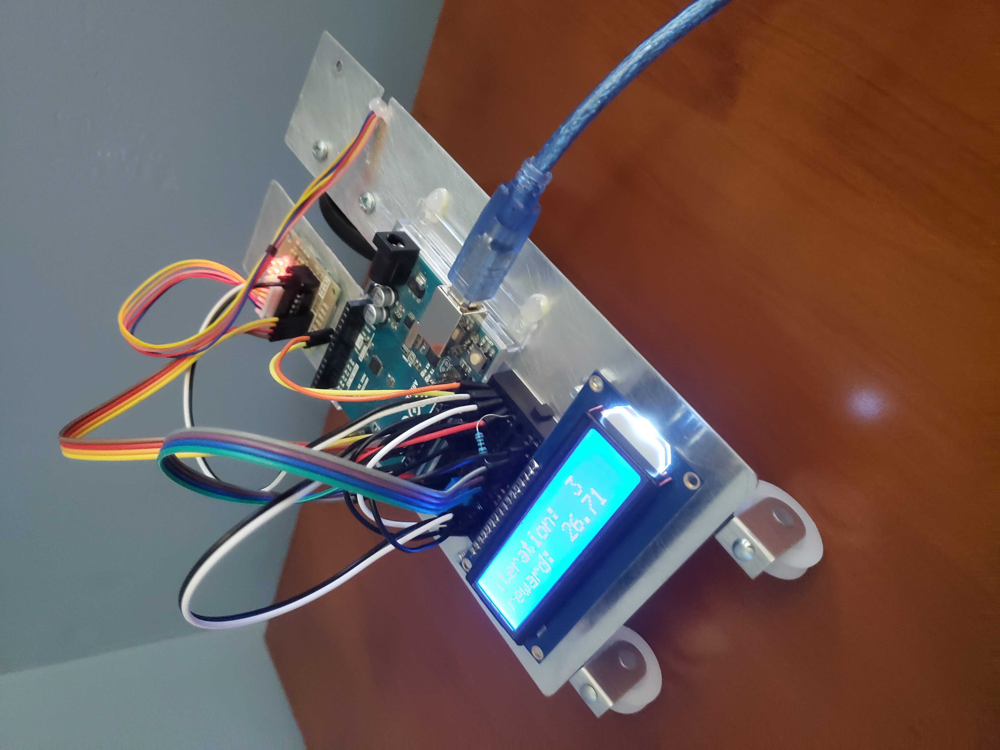
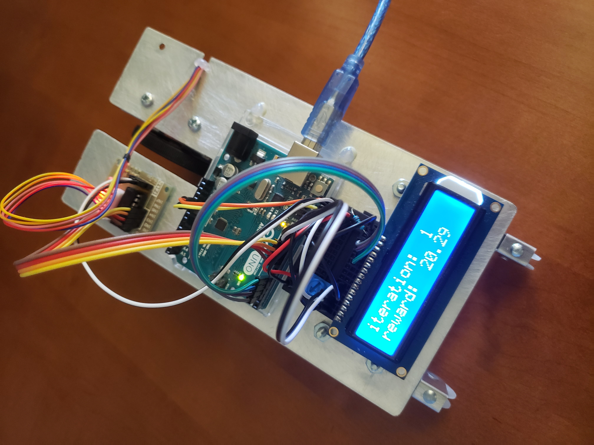
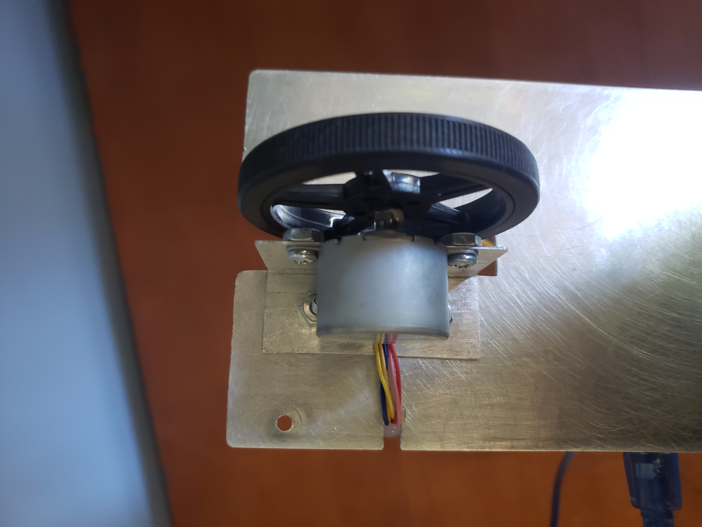
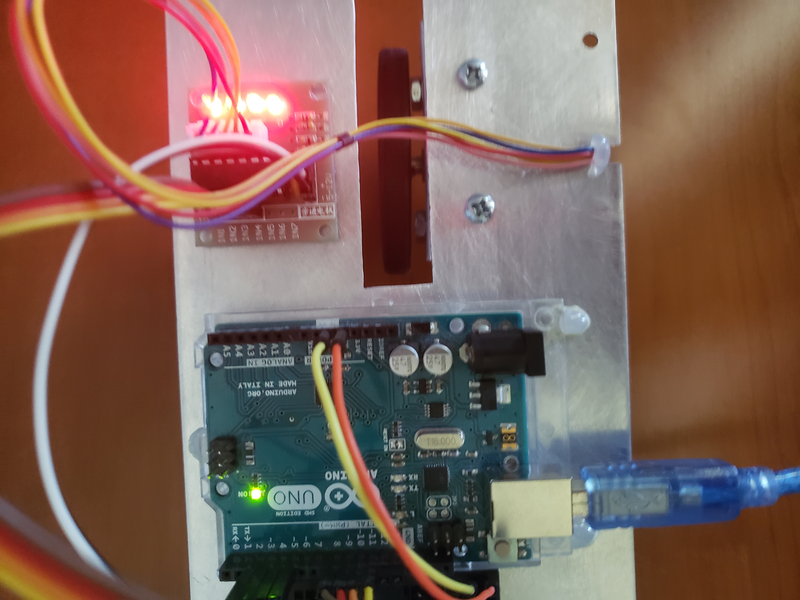

# ConsciousCar

Code: https://github.com/JohnLins/ConsciousCar/blob/main/ino/ino.ino

## Before Training:

## After Training:

## Logic:

<!--w = [\theta_{1}, \theta_{2}, \theta_{3},\dots]                                                   Reward = \sum_{i=1}^{|w|} { 2\pi*w_{i}}                                                            \nabla Reward(j) = \sum_{i=1}^{|w|}
\left\{ \begin{array}{ll}
2\pi & i=j \\
2\pi*w_{i} & else \\
\end{array}\right\}                                                        w_{i}^{new} = w_{i}^{old} + L \frac{\frac{\partial Reward}{\partial w_{i}}}{||\nabla Reward||}* (2\pi)-->

